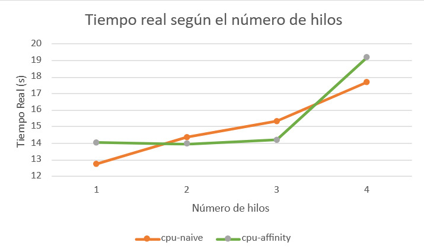
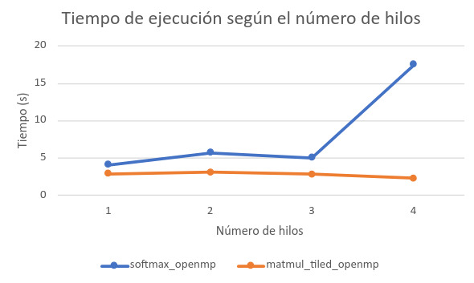

# Semana 4

## Características del sistema
- **Procesador:** Intel(R) Core(TM) i5-6300U CPU @ 2.40GHz
- **Arquitectura:** x86_64
- **CPU lógicas:** 4
- **Núcleos físicos:** 2
- **Hilos por núcleo:** 2
- **Sistema operativo:** Ubuntu 26.04 LTS (Resolute Raccoon)
- **Compilador:** GCC 15.2.0

---

# Práctica de clase 3

## Ejercicio A — CPU Affinity

Se compilaron y ejecutaron los programas `cpu-naive` y `cpu-affinity`. Asimismo, se cambió el número de hilos desde 1 hasta 4, ya que la computadora cuenta con 4 CPU lógicas.

> **Ejecución inicial sin modificar el código:** `cpu-naive` obtuvo un tiempo real de **33.813 s**, mientras que `cpu-affinity` no pudo ejecutarse porque el código estaba configurado para 8 hilos y la computadora dispone de 4 CPU lógicas.

### Resultados

| Hilos | cpu-naive (s) | cpu-affinity (s) |
| ----: | ------------: | ---------------: |
| 1 | 12.761 | 14.040 |
| 2 | 14.373 | 13.958 |
| 3 | 15.342 | 14.197 |
| 4 | 17.697 | 19.202 |

### Gráfico



### Speedup y eficiencia

El speedup se calculó como:

```text
Speedup = T1 / Tn
```

La eficiencia se calculó como:

```text
Eficiencia = Speedup / número de hilos
```

| Hilos | Speedup naive | Eficiencia naive | Speedup affinity | Eficiencia affinity |
| ----: | ------------: | ---------------: | ---------------: | ------------------: |
| 1 | 1.000 | 100.0 % | 1.000 | 100.0 % |
| 2 | 0.888 | 44.4 % | 1.006 | 50.3 % |
| 3 | 0.832 | 27.7 % | 0.989 | 33.0 % |
| 4 | 0.721 | 18.0 % | 0.731 | 18.3 % |

### Análisis

En `cpu-naive` el tiempo aumentó conforme se agregaron más hilos. Pero, en `cpu-affinity` los tiempos se mantuvieron bastante parecidos entre 1 y 3 hilos, pero con 4 hilos el tiempo aumentó.

La computadora tiene 2 núcleos físicos y 4 CPU lógicas, por lo que al utilizar más de 2 hilos algunos recursos del procesador se comparten.

<!-- También se debe tomar en cuenta que cada hilo agrega trabajo, por lo que al aumentar los hilos también aumenta la carga total. Por esta razón no se calculó directamente una proporción paralela y serial utilizando la Ley de Amdahl.-->

---

## Ejercicio B — Scaling con OpenMP

Se ejecutaron los programas `softmax_openmp` y `matmul_tiled_openmp`. El número de hilos se indicó como argumento de la aplicación. Por ejemplo:

```bash
./softmax_openmp 2
```

Se realizaron pruebas con 1, 2, 3 y 4 hilos.

> **Ejecución inicial sin modificar el código:** `softmax_openmp` obtuvo un tiempo de **41.318066 s** y `matmul_tiled_openmp` un tiempo de **3.342577 s**, ambos utilizando 4 hilos.

### Resultados

| Hilos | Softmax (s) | Matmul tiled (s) |
| ----: | ----------: | ----------------: |
| 1 | 4.112855 | 2.908235 |
| 2 | 5.703217 | 3.073318 |
| 3 | 5.016890 | 2.859251 |
| 4 | 17.529338 | 2.323534 |

### Gráfico



### Speedup y eficiencia

| Hilos | Speedup Softmax | Eficiencia Softmax | Speedup Matmul | Eficiencia Matmul |
| ----: | --------------: | -----------------: | -------------: | ----------------: |
| 1 | 1.000 | 100.0 % | 1.000 | 100.0 % |
| 2 | 0.721 | 36.1 % | 0.946 | 47.3 % |
| 3 | 0.820 | 27.3 % | 1.017 | 33.9 % |
| 4 | 0.235 | 5.9 % | 1.252 | 31.3 % |

### Análisis

En `softmax_openmp` el tiempo aumentó al agregar más hilos. Con 1 hilo tardó 4.112855 s y con 4 hilos tardó 17.529338 s. Por lo tanto, en este caso agregar hilos no mejoró el rendimiento. <!--El trabajo adicional relacionado con el manejo de varios hilos termina afectando el tiempo de ejecución.-->

Como el speedup de Softmax fue menor que 1, no se obtuvo una proporción paralela válida utilizando directamente la Ley de Amdahl.

En `matmul_tiled_openmp` se obtuvo un mejor resultado con 4 hilos. El tiempo pasó de 2.908235 s con 1 hilo a 2.323534 s con 4 hilos.

Con 4 hilos se obtuvo:

```text
Speedup: 1.252
Eficiencia: 31.3 %
```

Utilizando la Ley de Amdahl como una estimación se obtuvo aproximadamente:

```text
Parte paralela: 26.8 %
Parte serial:   73.2 %
```

Se podría decir que, la multiplicación de matrices aprovechó mejor el uso de varios hilos que Softmax.

---

# Práctica de clase 4

## Ejercicio A — Biblioteca estática

Primero se compilaron los ejemplos utilizando:

```bash
make -C libraries all
```

Luego se ejecutó la versión con biblioteca estática:

```bash
./libraries/build/bin/bench-static 1000000 1000 1.0 2.0
```

### Resultados

| Medición | Tiempo total (µs) | Tiempo por iteración (µs) |
| -------- | ----------------: | -------------------------: |
| Fill A | 2857188.291 | 2857.188 |
| Fill B | 2655603.936 | 2655.604 |
| Add | 3901613.748 | 3901.614 |
| Total | 9414407.070 | - |

El archivo generado fue:

```text
libraries/build/lib/libvectorops.a
```

Su tamaño fue:

```text
1.8K
```

### Análisis

La biblioteca estática utiliza la extensión `.a`. En esta medición el tiempo total fue aproximadamente de 9.41 s.

---

## Ejercicio B — Biblioteca dinámica

Se ejecutó la versión con biblioteca dinámica utilizando los mismos parámetros:

```bash
./libraries/build/bin/bench-dynamic 1000000 1000 1.0 2.0
```

### Resultados

| Medición | Tiempo total (µs) | Tiempo por iteración (µs) |
| -------- | ----------------: | -------------------------: |
| Fill A | 8922208.154 | 8922.208 |
| Fill B | 7938910.439 | 7938.910 |
| Add | 6522165.415 | 6522.165 |
| Total | 23383285.222 | - |

El archivo generado fue:

```text
libraries/build/lib/libvectorops.so
```

Su tamaño fue:

```text
16K
```

### Comparación

| Medición | Estática (µs) | Dinámica (µs) |
| -------- | ------------: | ------------: |
| Fill A | 2857188.291 | 8922208.154 |
| Fill B | 2655603.936 | 7938910.439 |
| Add | 3901613.748 | 6522165.415 |
| Total | 9414407.070 | 23383285.222 |

### Análisis

En estas mediciones, la versión estática fue más rápida que la versión dinámica. El tiempo total de la versión estática fue aproximadamente de 9.41 s, mientras que la versión dinámica tardó aproximadamente 23.38 s.

También se obtuvieron los siguientes tamaños:

| Biblioteca | Tamaño |
| ---------- | -----: |
| `libvectorops.a` | 1.8K |
| `libvectorops.so` | 16K |

La biblioteca estática utiliza un archivo `.a`, mientras que la biblioteca dinámica utiliza un archivo `.so`.

La biblioteca estática se enlaza con el programa durante la compilación, mientras que la biblioteca dinámica se mantiene como un archivo externo utilizado por el programa.

